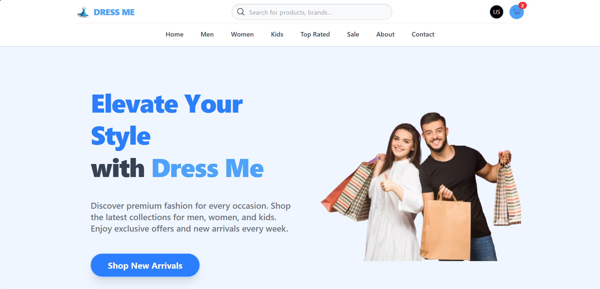
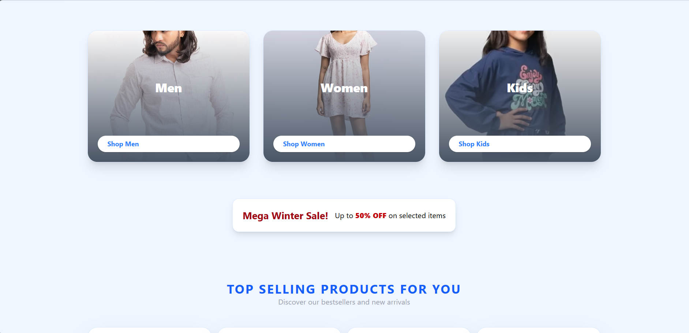
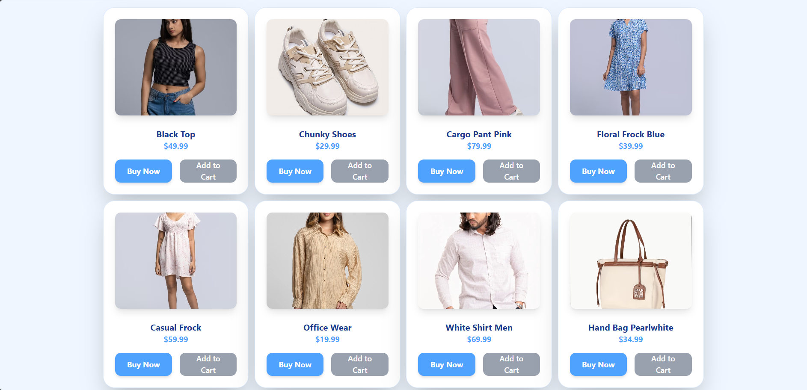
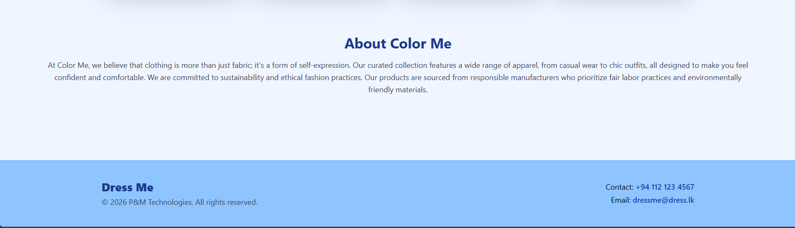

# DressMe

DressMe is a full-stack fashion simple web application Home page with a React + Vite frontend and an Express + MongoDB backend.

## Project Overview

This repository contains:

- A customer-facing fashion storefront UI (home, contact, sign-in, sign-up pages).
- A Node.js backend foundation for authentication with MongoDB models and auth routes.

## Tech Stack

### Frontend

- React 19
- Vite 7
- React Router
- Tailwind CSS 4

### Backend

- Node.js + Express 5
- MongoDB + Mongoose
- JWT authentication
- bcrypt for password hashing


<h2>Output Images</h2>







## Folder Structure

```text
DressMe/
	backend/
		config/
		middleware/
		models/
		routes/
		server.js
	dressme/
		src/
		public/
		index.html
```

## Prerequisites

Install the following before running the project:

- Node.js (18+ recommended)
- npm
- MongoDB Atlas connection string (or local MongoDB)


